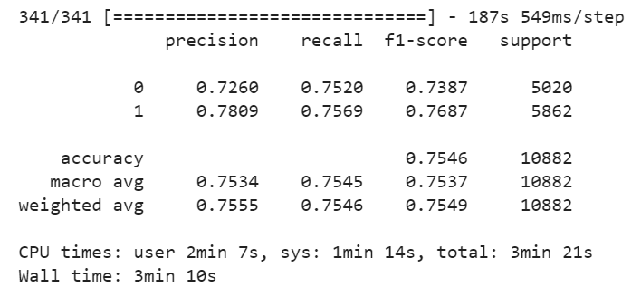

# Twitter Authority : Basic tasks of NLP

Take the first step to detect hoax tweets

https://quevico.com/competitions/104

# Introduction

In the field of artificial intelligence, the concept of natural language processing is extremely appealing and is full of potential. The internet is flooded with languages and because of that, the amount of data to be analyzed is enormous and continues to expand every second. Search engines, machine translation, chat bots, as well as audio interfaces like Alexa and Google Home are all supported by natural language processing. If natural language processing is developed further, massive amounts of unstructured data like those on Wikipedia may be structured, allowing better information to be accessed more easily.

This competition involves the construction of a model through the practical and fundamental machine learning of natural language processing using data obtained from Twitter. An entirely unique set of data consisting of a collection of around 100,000 lines of organized and annotated tweets will be used.

# Task
The internet is inundated with false rumors and fake news. Hoarding as a result of misinformation during times of disaster should still be fresh in your memory. In order to see through such misinformation, the objective of the task is to develop a machine learning model to determine whether the account tweeting is verified.

Over 100,000 lines of data consisting of tweets from both verified and non-verified users have been organized.

# Data
Verified accounts are determined by the presence of a verification badge, a link from a corporate website (verification by the corporation), and other factors that lead the data collector to conclude that the account has a high degree of authoritativeness. Non-verified accounts refer to all other accounts, including anonymous accounts and individual hobby accounts.

Annotation rules
0: Tweets from verified accounts
1: Tweets from non-verified accounts
*The presence or absence of the badges were current at the time of data collection and may have changed.

# My Baseline

I built a baseline model based on RNN architecture to classify text. The result is fine. I gained an accuracy of about 0.7546 in the validation set and 0.7474 in the leaderboard (rank: 8/136 entries).

*iThe result in validation*

*The result in leaderboard*

I joined the competition very close to the deadline, I can't improve my model better as well as upload the final submission (miss a deadline) so I do not know the accuracy of the final submission and the final score.